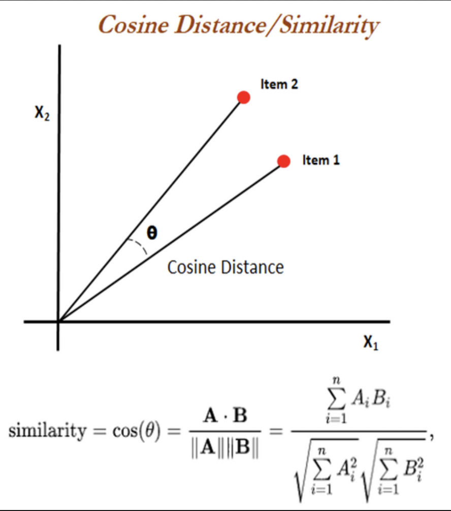

# Projet Infrastructure et Systèmes Logiciels - Application de Recommandation de films Cinématch

 
## ENSAE Paris - MS Data Science
 
Membres du groupe : 
- Jérémy DREUMONT , Ahmed OUASSOU , Cindy PORFIRIO, Ilias RAZIG, David SERRUYA

<h2 style="color: blue;"> ## Objectif </h2>
 
Ce projet Python a été créé dans le but de fournir à des utilisateurs des recommandations personnalisées de films à regarder sur la base de plusieurs méthodes de recommandation : le filtrage collaboratif et l'utilisation de NLP sur les synopsis des films. Ce dernier se traduit par une application web où vous trouverez le lien vers la démo youtube ici : 

## Fonctionnalités générales
 
1. **Recommandation par filtrage collaboratif :** Après la connexion de l'utilisateur, l'utilisateur renseigne les films qu'il a regardé parmi la liste des films ainsi que leurs notes correspondantes. Par la suite un algorithme de filtrage collaboratif basé sur la décomposition de matrice propose des recommandations de films basé sur les notes entrées. Cette approche identifie les utilisateurs similaires en fonction de leurs historiques de notation pour faire des recommandations.
   
     De manière générale, il est à noter que cette méthode est confrontée à plusieurs limites dont le problème de démarrage à froid signifiant que les nouveaux utilisateurs doivent noter suffisamment de films pour que le système puisse déterminer leurs préférences. Par ailleurs, les nouveaux films n'ayant pas encore été suffisamment notés ne peuvent être recommandés de manière fiable.
Une seconde limite qu'on pourrait appeler "homogénisation des recommandations" est l'idée selon laquelle l'algorithme tend à recommander des films populaires et biens notés, conduisant à une certaine uniformité des recommandations et ainsi une sous-représentation des films de niche. Enfin, les évaluations de films peuvent connaître des inexactitudes dues au manque d'implication des utilisateurs au moment de la notation, ce qui introduit des biais et réduit la pertinence des recommandations générées par le système.

4. **Recommandation par NLP :** L'utilisateur interagit avec une boite de dialogue contenant le message 👋! Que voulez-vous voir aujourd'hui ?" . L'utilisateur entre par la suite un texte contenant ses envies de films à regarder afin d'obtenir des recommandations basées sur le texte entré. Cette étape implique l'extraction des mots-clés pertinents et la détermination des préférences sous-jacentes de l'utilisateur. Par exemple, si un utilisateur écrit "Je veux un film d'aventure", le système identifie un ou des éléments clés tels que "aventure".Néanmoins, cette méthodologie est confronté à des limites lors de l'analyse sémantique. Le système ne peut pas toujours interpréter correctement les préférences de l'utilisateur notamment pour des demandes complexes ou très spécifiques.

## Fonctionnalités détaillées

### Connexion et Gestion des Utilisateurs

L'utilisateur établit un première connexion à une base de données PostgresSQL. Cette étape gère l'état de la session d'authentification et ajoute un nouvel utilisateur à la base de données après avoir vérifié que le nom d'utilisateur n'est pas déjà pris.

### Gestion des films

Dans un premier temps, l'utilisateur doit noter les films afin que le système puisse recommander des nouveaux films. Suite à cette étape la base de données est mise à jour avec les nouveaux films ou notes ajoutés par un utilisateur.

### Recommandations de films

Il est à noter qu'en amont la base de données a été nettoyé (gestion des valeurs aberrantes) mais aussi le texte a été pré-traité en ne conservant que les mots alphanumériques. Autrement dit, les signes de ponctuation et les mots peu informatifs (comme "le", "et", "dans", etc.) sont éliminés réduisant le bruit dans les donnée.

- *Les "meilleurs films"* : Affiche les films mieux notés de la base de données (c'est-à-dire les films ayant des notes supérieures à 4.1).
  
- *Recommadation NLP* : La méthode utilisée est le traitement du language naturel avec TF-IDF (Term Frequency-Inverse Document Frequency) et Nearest Neighbors.
Cette fonction utilise le NLP pour analyser la description textuelle donnée par l'utilisateur. Elle convertit cette description en vecteurs numériques à l'aide de la méthode TF-IDF, qui mesure l'importance d'un mot dans un document par rapport à une collection de documents. Ensuite, elle utilise l'algorithme des plus proches voisins (Nearest Neighbors) pour trouver les films dont les synopsis sont les plus similaires à la description de l'utilisateur.

Utilise TF-IDF pour convertir les synopsis des films en vecteurs et puis applique la similarité cosinus pour trouver les films dont les synopsis sont le plus similaires à ceux qu'un utilisateur a déjà appréciés. On appelle "similarité du cosinus" une mesure mathématique qui détermine à quel point deux vecteurs sont similaires en calculant le cosinus de l'angle entre eux. Une valeur proche de 1 indique une grande similarité, tandis qu'une valeur proche de 0 indique peu ou pas de similarité.

- *Plus de genres* : Analyse basée sur le genre autrement dit le système suggère des films dans le genre que l'utilisateur semble préférence au regard de son historique.
  
- *Recommandations Collaboratives* : Méthode basée sur les notes des utilisateurs et les similarités entre eux avec SVD (Singular Value Decomposition). Elle utilise la décomposition en valeurs singulières (SVD) pour créer un système de recommandation basé sur le filtrage collaboratif. Elle prédit les notes qu'un utilisateur pourrait donner à des films qu'il n'a pas encore vus, basé sur les préférences d'utilisateurs aux goûts similaires.

## Les étapes pour accéder à l'application 

1.
2. 

## 

## Références

- GroupLens (2019).MovieLens 25M Dataset : https://grouplens.org/datasets/movielens/25m/ & https://www.kaggle.com/datasets/garymk/movielens-25m-dataset
- 
